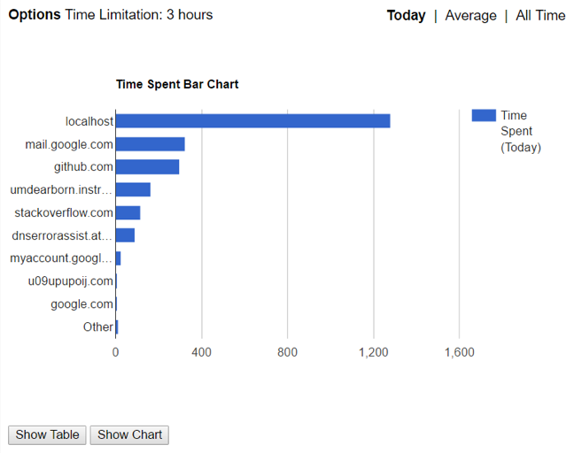
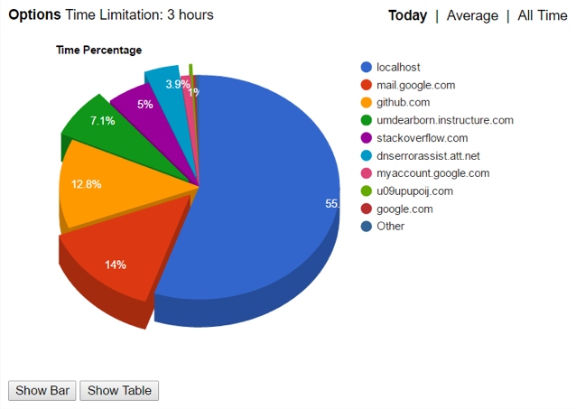
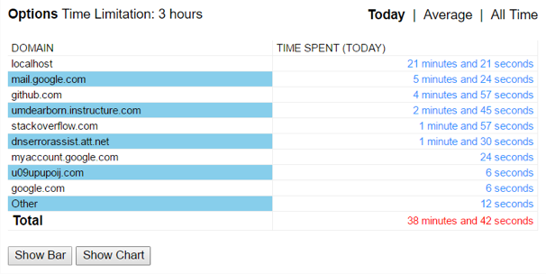
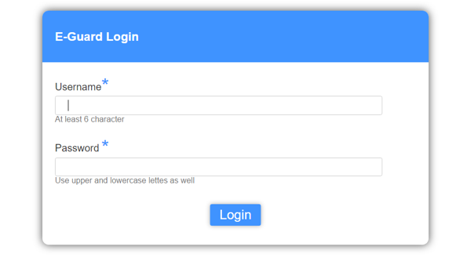
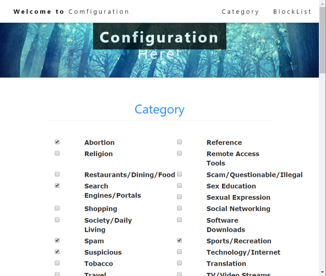
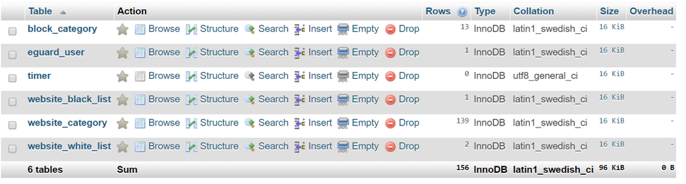
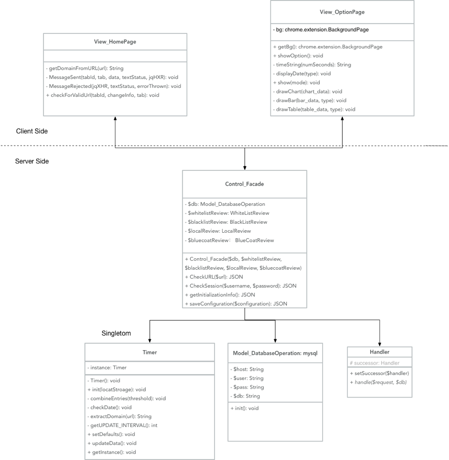
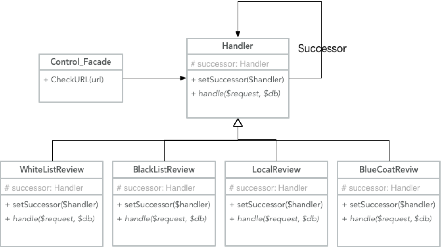
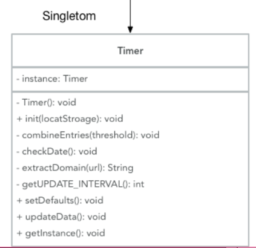

# 566 Term Project - E-Guard ReadMe
Authur: Ting Zhou

## Software and Libiaries

1. MAMP or XAMPP is used as Apache server and Mysql DB setup.
2. Chrome.tabs is the main Chrome API I used to control the chrome's page. Everytime user access to a new page, the extension's background.js will check if the  URL is allowed.

## Installation Steps:

1. Create a DB in Phpmyadmin called e_guard. Import the *DB.sql* from the directory *'{server root directory}/E-Guard/E-Guard-Database'*
2. Load the extension directory "./E-Guard/E-Guard-Client" from the Chrome Extension Page.
3. You can click the E-Guard Extension -> Options to get to the configuration page.
4. You can uninstalll it by click the uninstall icon from the Chrome Extension page.

## User Interface
1. Chrome Extension Popup Page

   This is the Client side of my E-Guard chrome extension. I implemented 3 visualization pages for visualizing the time spent on visited websites, Bar Chart, Table, Chart. 

   There are 3 ways to view the time spent on visited websites, Today, Average and All Time. These are just the same localStorage data in Chrome extension labeled differently.

   - Bar Chart

   

   - Pie Chart

    

   - Table

    

2. Configuration Page

   - Login

    

   - Pick Categories

    

   - Block List

    

3. Database Structure

    

## Class Diagram

1.    Facade

      Façade Design Pattern is used to help the E-Guard System to control the system overall. The Client Side (Chrome extension) communicates the Server Side (program run on the Apache server) through the Control_Facade. 

       

2. Chain of responsibility

      The Handler class uses CoR design pattern. The chain responsibilities are like this: WhiteListReview -> BlackListReview -> LocalReview -> BlueCoatReview  -> LocalReview.

       

3. Singleton

      The Singleton Design Pattern is used to implement the Timer class. Singleton Pattern makes sure the Timer only has one instance in the System. Timer is used to set the time limitation for the E-Guard.

       

